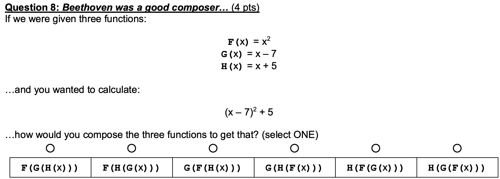

# Function Composition
Autoquiz component to generate questions like #8 on CS10 Fall 2018 [Quest](http://cs10.org/fa19/exams/quest/2018Fa/exam.pdf) 



## Contributors
- [Sierra Dean](https://github.com/sierradean)
- [Max Yao](https://github.com/bojinyao)
- [Bob Zhao](https://github.com/honglizhaobob)
# Table of Contents
- [Function Composition](#function-composition)
  - [Contributors](#contributors)
- [Table of Contents](#table-of-contents)
- [Get Started](#get-started)
  - [Software Requirement](#software-requirement)
- [Usage](#usage)
- [Bugs](#bugs)
  
# Get Started

## Software Requirement
- Python 3

To get project code, first clone the project directory:
```shell
$ git clone git@github.com:sierradean/function_composition.git
```
The project will be saved under `function_composition` directory. Since this project is written to be a python module, one can run the directory with python directly.

```shell
$ python3 function_composition -h
```

In the above example, `-h` option will show usage and help information
# Usage
Below is the printed help message out of the box. Currently, the module is capable of generating 6 different types of simple functions
```text
usage: [-h] [-o] [-f] [-c] [-q] [-b]

Process function composition program. Default output is stdout.

optional arguments:
  -h, --help            show this help message and exit
  -o , --out            Path to file for output, create file if necessary.
                        Default output is stdout.
  -f , --num_functions 
                        number of functions to have as answer, must be at
                        least 1, at most 6. Default 3
  -c , --num_choices    number of choices to present to the user, 1 < num
                        choice <= factorial(num functions). Default 5
  -q , --questions      number of questions to generate in file, default is 1.
                        Must be no greater than factorial(num functions)
  -b, --body_only       output only the form and submit without the html
                        headers
```

Without any option, program will output generated HTML form to standard-out.

# Bugs

